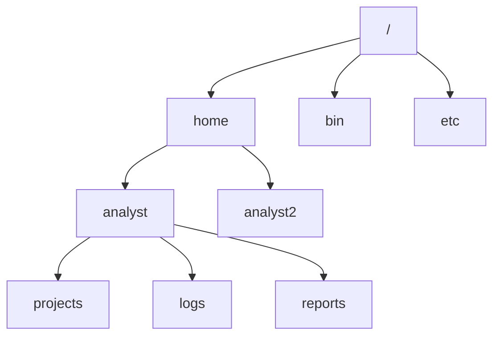

## Distribuciones de Linux
Las versiones de linux se llaman distribuciones. Algunos las llaman "distros" o "sabores". Debes conocer la distribución que usas para saber qué herramientas y apps hay. Por ejemplo, Debian y ubuntu son distribuciones con herramientas distintas. Usemos una analogía para describir las distribuciones. El SO es como un vehículo. Primero empezamos con el motor, o sea el kernel. Al igual que el motor hace que el vehículo funcione, el kernel es el componente más importante de Linux. Como el kernel es de código abierto, cualquiera puede modificarlo y crear una nueva distribución. Es como si un fabricante de vehículos modifica un motor y crea varios vehículos: camiones, autos, furgonetas, descapotables, autobuses, aviones, etc. Estos vehículos son como las distintas distribuciones de Linux. Un autobús se usa para transportar a mucha gente; un camión, para transportar mercancía a largas distanciasñ un avión, para transportar pasajeros o mercancías por aire. Así como cada vehículo cumple un objetivo, las distribuciones se usan por distintos motivos. Además, los vehículos tienen componentes que los distinguen uno del otro. Los aviones tiene paneles con botones y perillas. Los autos tienen cuatro llantas, los camiones más. Las distribuciones contienen distintos programas preinstalados, interfaces de usuario y mucho más. Depende much de las necesidades del usuario, pero algunas distribuciones se eligen según la preferencia, al igual que se elige un auto deportivo. La ventaja de usar Linux es que se puede personalizar. Las distribuciones tienen el kernel, utilidades, sistema de gestión de paquetes y un instalador. Antes vimo que Linux es de código abierto, cualquiera puede contribuir al código fuente. Así se crean las distribuciones. Todas se derivan de otra distribución, pero algunas son distribuciones madre. Red hat es la madre de CentOS, slackware es la madre de SUSE. Ubuntu y Kali Linux se derivan de Debian. 

## Kali LINUX
Una distribución usada mucho en seguridad es una marca de Offensive Security, derivado de Debian. Esta distribución de código abierto se creó para el pentesting y análisis forense digital. Kali Linux tiene herramientas preinstaladas. Ten en cuenta que debe usarse en una máquina virtual. Así se evitan daños en el sistema si sus herramientas se usan mal. Otra ventaja es que con la máquina virtual puedes revertir a un estado anterior. Con el tiempo, algunos profesionales se especializan en pentesting. Es una prueba de penetración, un ataque simulado para identificar vulnerabilidades en sistemas, red, sitios, apps y procesos. Kali Linux tiene herramientas que sirven para el pentesting.

Veamos algunos ejemplos. Metasploit sirve para buscar y explotar vulnerabilidades en equipos. Con Buro Suite se buscan debilidades en apps web. Finalmente Jhon the Ripper sirve para adivinar contraseñas. Como analista, puede encargarte del análisis forense digital. El análisis forense digital consiste en recopilar y analizar datos para determinar qué ocurrió tras un ataque. Por ejemplo, podrías investigar datos relacionados con la actividad de red. Kali Linux también sirve para los profesionales en el campo forense digital. Tiene muchas herramientas para eso. Tcpdump analiza paquetes de línea de comandos. Se usa para capturar el tráfico de red. Wireshark es otra herramienta usada comúnmente en la seguridad. Tiene una GUI que puede usarse para analizar tráfico de red en vivo y capturado. Un último ejemplo, Autopsy es una herramienta forense para analizar discos duros y smartphones. Estas son algunas herramientas incluidad en Kali Linux. La distrubución ofrece muchas herramientas de pentesting y análisis forse digital.

## Instalación software kali linux
* Tarea 1: Asegúrate de que la aplicación APT esté instalada

`$ apt`
APT es el administrador de paquetes recomendado para Debian.

* Tarea 2: Instala y desinstala la aplicación Suricata

`$ sudo apt install suricata`

Usar el administrador de paquetes para instalar la aplicación suricata.

>[!Note]
> Los comandos `apt install` y `apt remove` deben incluir el comando `sudo` como prefijo ya que se requieren privilegios elevados para instalar y desinstalar software en Linux. Es posibble que demore algunos minutos.

Verificar que esté instalada, para ello ejecutamos la aplicación instalada recientemente.

`$ suricata`

Cuando se instale, se presentará la información de uso y la versión.

Ahora utilizaremos el administrador de paquetes para desinstalar Suricata.

`sudo apt remove suricata`

Para verificar que se haya desinstalado solo ejecutamos el comando de la aplicación nuevamente.

`$ suricata` y luego presiona intro.

Si está desinstalado, aparecerá un mensaje de error `-bash: /usr/bin/suricata: No such file or directory`.

* Tarea 3: Instala la aplicación tcpdump

En esta tarea, debemos instalar la aplicación tcpdump. Se trata de una herramienta de línea de comandos que se puede usar para capturar tráfico de red en una shell Bash de Linux.

Usa el administrador de paquetes APT para instalar tcpdump.

`sudo apt install tcpdump`

* Tarea 4: Genera una lista de las aplicaciones instaladas.

A continuación, debes confirmar que instalaste las aplicaciones indicadas. Es importante confirmar que se instalaron las aplicaciones correctas. Te suferimos que también verifiques con frecuencia que se hayan instalados las versiones adecuadas.

1. Usa el apt para generar una lista de todas las aplicaciones instaladas.

`apt list --installed`

* Tarea 5: Reinstala la aplicación Suricata

`sudo apt install suricata`

## Introducción a Shell
Esta parte de la arquitectura de Linux es donde trabajarás como analista. Antes vimos el shell con otros componentes de Linux, pero veamos qué es y qué lo hace. El shell intepreta líneas de comandos. Es decir, te comunica con el SO mediante la línea de comandos. Antes vimos la interfaz de línea de comandos. Básicamente, eso es el shell. El shell ofrece la línea de comandos para que interactúes con el SO.

Para decirle al SO qué hacer, ingresas comandos en esta interfaz. Un comando le indica a la computadora que haga algo. El shell se comunica con el kernel para ejecutar comandos. Antes vimos cómo el SO permite que el usuario se comunique con la computadora. EL shell es la parte del SO que logra esto.

Es como un intérprete útil entre tú y el sistema. No hablas el idioma de la computadora, binario, así que no puedes comunicarte de forma directa. El shell te ayuda con eso. El so necesita el shell para la mayoría del trabajao, pero es una interfaz entre tú y el sistema. Te permite hacer cálculos, realizar pruebas y ejecutar apps. Sobre todo, te permite combinar estas operaciones y conectar apps entre sí para realizar tareas complejas y automatizadas. Hay muchas distrbicuiones de Linux y también muchos tipos de shells.

## Entrada y salida del shell
Al comunicarte con el shell, los comandos en este pueden recibir datos, producir salidas o dar mensajes de error. Veamos que la entrada estándar, salida estándar y mensajes de error. La entrada estándar es información que recibe el SO por la línea de comandos. Es como preguntarle a tu amiga algo en una conversación. La información se ingresa al shell mediante el teclado. Si el shel interpreta tu solicitud, le pide al kernel los recursos para ejecutar la tarea. Veamos el comando echo, que emite una cadena de texto especificada. Los datos de cadena son una secuencia ordenada de caracteres. En nuestro ejemplo, solo produce la cadena "Hello".

Como entrada, escribiremos "echo hello" en el shell.

Luego presionamos intro para obtener la salida. Pero antes, profundicemos en el concepto de salida. La salida estándar es la información que devuelve el SO por el shell. Así como tu amiga responde a tu pregunta, la salida es la respuesta de una computadora a tu mando.

La saluda es lo que recibes. Retomemos nuestro ejemplo y enviemos la entrada "echo hello" al SO presionando intro. De inmediato, el shell devuelve la salida "hello". Finalmente el error estándar tiene mensajes de error que devuelve el SO por el shell. El sistema da un mensaje de error si no puede responder al comando. Esto puede ocurrir al escribir mal un comando o si el sistema no conoce la respuesta al comando. También puede ocurrir porque no tenemos los permisos para ejecutar un comando. Veremos otro ejemplo de error estándar. Ingresemos "eco hello" en el shell. Observa que escribí "eco" y no "echo". Al presionar intro aparece un mensaje de error.

## Entrada y salida en el shell
* Genera resultados con el comando echo:

1. ingresa echo hello en la shell y presiona intro.

2. Vuelve a ejecutar el comando, pero encierra los datos de la cadena entre comillas. Ingresa echo "hello" en la shell y presiona intro.
   
3. Usa el comando echo para obtener como resultado tu nombre en la shell.

* Genera resultados con el comando expr

1. Calcula la cantidad de falsos positivos mediante el comando expr.
   
   Ingresa expr 32 - 8 en la shell y presiona intro.

2. Ingresa expr 3500 * 12 en la shell y presiona intro.

* Despeja la shell Bash
  
1. Ingresa clear en la shell.

* Opcional, realiza más cálculos con el comando expr

1. Genera al menos un nuevo resultado con el comando echo.
2.  Realiza al menos un cálculo más con el comando expr.

## Comandos de Linux a través del shell bash
Los fundamentos para comunicarse con el SO a través del shell. Saber usar los comandos de Linux es fundamental para los profesionales de seguridad. Como analista de seguridad, trabajarás con registros del servidor, y deberás saber navegar, gestionar y analizar archivos de forma remota sin GUI. También debes saber cómo verificar y configurar usuarios y acceso de grupos. Además deberás dar autorización y configurar permisos de archivo. Tener habilidades con la línea de comandos es esencial para tu trabajo como analista de seguridad. AL ver la arquitectura de Linux, aprendimos que el shell es un componente principal del SO. También vimos que hay diversos shells. En esta sección, usaremos Bash. Bash es el shell incluido en casi totdas las distribuciones de Linux. En su mayor parte, los comandos clave que verás aquí son los mismo en todos los shells. Ahora que sabes qué shell usarás, veamos como escribir en Bash. Como vimos antes, comunicarse con el SO es como una conversación. Ingresas comandos y el SO responde con una respuesta a tu comando. Un comando le pide a la computadora que haga algo. probaremos un comando en Bash. Observa el signo $ antes del cursor. Esto indica que ingreses un nuevo comando. Algunos comandos le puden a la computadora que busque algo, como un archivo específico. Otros piden abrir un programa. Y otros piden producir una cadena de texto. En la última sección, al ver la entrada y la salida, exploramos cómo el comando echo lo hacía. Ingresemos el comando echo de nuevo.

Quizá observes que el comando que ingresamos no está completo. Si vamos a usar el comando echo para generar una cadena de textos, hay que especificar cuál es la cadena de texto. Para eso tenemos los argumentos. Un argumento es información específica que un comando necesita. Algunos comandos necesitan de varios argumentos. Completemos el comando echo con un argumento. Esto bastante técnico, así que produzcamos la frase "You are doing great!". Agregamos este argumento, y luego presionamos intro para obtener la salida.

En este ejemplo, el argumento fue una cadena de texto. Los argumentos también dan otra información. Algo muy importante en Linux es que los comandos y argumentos distinguen mayúsculas y minúsculas. Esto incluye los nombres de archivos y directorios. Tenlo en cuenta mientras aprendes acerca de cómo usar Linux en tus tareas diarias como analista de seguridad.

## Comandos principales para la navegación y la lectura de archivos
Comandos comunes para navegar por el sistema de archivos.

* **pwd** imprime el directorio de trabajo en la pantalla.

* **ls** muestra los nombres de los archivos y directorios en le directorio de trabajo actual.

* **cd** navega entre directorios, se usa para cambiar de directorio.

## Navega por Linux y lee contenido de archivos

* Estándar de jerarquía del sistema de archivos (FHS)

Es el componente de Linux que organiza los datos. El FHS es importante porque define cómo se organizan los directorios, el contenido de estos y otros tipos de almacenamiento en el sistema operativo.

## Directorios estándar del FHS

Justo debajo del directorio raíz, encontrarás los directorios estándar del FHS. En el diagrama, home, bin y etc son eso mismo. Estos son algunos ejemplos del contenido de los directorios estándar:

    /home: Cada usuario del sistema obtiene su propio directorio de inicio.

    /bin: Este directorio significa “binario” y contiene archivos binarios y otros archivos ejecutables. Los archivos ejecutables contienen una serie de comandos que una computadora debe seguir para ejecutar programas y llevar a cabo otras funciones.

    /etc: Este directorio almacena los archivos de configuración del sistema.

    /tmp: Este directorio almacena varios archivos temporales. Las/los atacantes suelen usar el directorio /tmp porque cualquier persona en el sistema puede modificar datos en estos archivos.

    /mnt: Este directorio significa “montaje” y almacena medios, como unidades USB y discos duros.

>[!Note]
> Consejo profesional: Puedes usar el comando man hier para obtener más información acerca del FHS y sus directorios estándar.

## Subdirectorios específicos del usuario

En home hay subdirectorios para usuarios específicos. En el diagrama, estos usuarios son analyst y analyst2. Cada usuario tiene sus propios subdirectorios personales, como projects, logs o reports.

Nota: Cuando la ruta conduce a un subdirectorio debajo del directorio de inicio del usuario, este puede representarse con una virgulilla (~). Por ejemplo, /home/analyst/logs también puede representarse como ~/logs.

Puedes navegar a subdirectorios específicos utilizando sus rutas de archivo absolutas o relativas. La ruta de archivo absoluta es la ruta completa del archivo, que comienza desde la raíz. Por ejemplo, /home/analyst/projects es una ruta de archivo absoluta. La ruta de archivo relativa comienza en el directorio actual del usuario.

>[!Note]
> Las rutas de archivo relativas pueden usar un punto (.) para representar el directorio actual, o dos puntos (..) para representar el directorio superior del directorio actual. Un ejemplo de una ruta de archivo relativa podría ser ../projects.

## Comandos clave para navegar por el sistema de archivos

Los siguientes comandos de Linux pueden utilizarse para navegar por el sistema de archivos: pwd, ls y cd.

* pwd

El comando pwd imprime el directorio de trabajo en la pantalla. O, en otras palabras, devuelve el directorio en el que te encuentras actualmente. 

La salida te da la ruta absoluta a este directorio. Por ejemplo, si estás en tu directorio home y tu nombre de usuario es analyst, al ingresar pwd, obtienes como resultado /home/analyst. 

Consejo profesional: Para saber cuál es tu nombre de usuario, usa el comando whoami. El comando whoami devuelve el nombre de usuario del usuario actual. Por ejemplo, si tu nombre de usuario es analyst, al ingresar whoami obtienes como resultado analyst.

* ls

El comando ls muestra los nombres de los archivos y directorios en el directorio de trabajo actual. En el video, por ejemplo ls devolvió directorios como logs y un archivo llamado updates.txt. 

Nota: Si quieres acceder al contenido de un directorio que no sea tu directorio de trabajo actual, puedes agregar un argumento después de ls con la ruta de archivo absoluta o relativa al directorio deseado. Por ejemplo, si estás en el directorio /home/analyst pero quieres enumerar el contenido de tu subdirectorio projects, puedes ingresar ls /home/analyst/projects o simplemente ls projects.

* cd

El comando cd se usa para navegar entre directorios. Cuando necesites cambiar de directorio, debes usar este comando.

Para navegar a un subdirectorio del directorio actual, puedes agregar un argumento después de cd con el nombre del subdirectorio. Por ejemplo, si estás en el directorio /home/analyst y quieres navegar a tu subdirectorio projects, puedes ingresar cd projects.

También puedes navegar a cualquier directorio específico ingresando la ruta de archivo absoluta. Por ejemplo, si estás en /home/analyst/projects, al ingresar cd /home/analyst/logs cambias de tu directorio actual a /home/analyst/logs.

Consejo profesional: Puedes usar la ruta de archivo relativa e ingresar cd .. para subir un nivel en la estructura de archivos. Por ejemplo, si el directorio actual es /home/analyst/projects, al ingresar cd .. cambiarías tu directorio de trabajo a /home/analyst. 
Comandos comunes para leer el contenido del archivo

Los siguientes comandos de Linux son útiles para leer el contenido del archivo: cat, head, tail y less.

* cat

El comando cat muestra el contenido de un archivo. Por ejemplo, al ingresar cat updates.txt, se devuelve todo el contenido del archivo updates.txt.

* head

El comando head muestra solo el comienzo de un archivo; 10 líneas, por defecto. El comando head puede ser útil cuando quieres conocer el contenido básico de un archivo pero no necesitas todo el contenido. Al ingresar head updates.txt, obtienes solo las primeras 10 líneas del archivo updates.txt.

Consejo profesional: Si quieres cambiar el número de líneas que devuelve el comando head, puedes incluir -n para especificar el número de líneas. Por ejemplo, si solo quieres que se te muestren las primeras cinco líneas del archivo updates.txt, ingresa head -n 5 updates.txt.

* tail

El comando tail hace lo opuesto a head. Este comando puede usarse para mostrar solo el final de un archivo; 10 líneas, por defecto. Al ingresar tail updates.txt, obtienes solo las últimas 10 líneas del archivo updates.txt.

Consejo profesional: Puedes usar tail para leer la información más reciente en un archivo de registro.

* less

El comando less devuelve el contenido de un archivo, una página a la vez. Por ejemplo, al escribir less updates.txt, se cambia la ventana de la terminal para mostrar el contenido de updates.txt una página a la vez. Esto te permite avanzar y retroceder por el contenido, con facilidad. 

Una vez que hayas accedido a tu contenido con el comando less, puedes usar varios controles de teclado para moverte por el archivo:

    Barra espaciadora: desplazarse a la página siguiente

    b: desplazarse a la página anterior

    Flecha hacia abajo: avanzar una línea

    Flecha hacia arriba: retroceder una línea

    q: salir y volver a la ventana de terminal anterior

## Conclusiones clave

Es importante que las/los analistas de seguridad sepan navegar por Linux y el sistema de archivos del FHS. Algunos comandos clave para navegar por el sistema de archivos son pwd, ls y cd. Saber leer el contenido de archivos también es una habilidad importante en la profesión de ciberseguridad. Esto puede hacerse con comandos como cat, head, tail y less.   